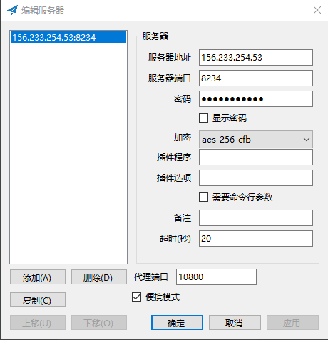

# 使用shadowsocks快速搭建一个VPN

## 1. shadowsocks server构建

1. 直接使用python的shadowsocks包进行安装。

   ```shell
   pip install shadowsocks
   ```

2. 配置 /etc/shadowsocks.json

   ```json
   {
       "server":"0.0.0.0",
       "server_port":8091,
       "local_address": "127.0.0.1",
       "local_port":1080,
       "password":"123456",
       "timeout":300,
       "method":"aes-256-cfb",
       "fast_open": false
   }
   ```

   | **Name**      | **Explanation**                  |
   | ------------- | -------------------------------- |
   | server        | 服务端地址                       |
   | server_port   | 服务端端口                       |
   | local_address | 本地地址                         |
   | local_port    | 本地端口                         |
   | password      | 密码                             |
   | timeout       | 超时时长                         |
   | method        | 加密方式，一般使用aes-256-cfb    |
   | fast_open     | 开启TCP_FAST_OPEN，true或者false |
   | workers       | 工作线程个数                     |

3. 多用户的配置，以后应该用得到，给不同的用户绑定不同的端口使用

   ```json
   {
       "server": "0.0.0.0",
       "port_password": {
           "8381": "foobar1",
           "8382": "foobar2",
           "8383": "foobar3",
           "8384": "foobar4"
       },
       "timeout": 300,
       "method": "aes-256-cfb"
   }
   ```

4. 启动服务

   ```shell
   ssserver -c /etc/shadowsocks.json -d start
   ```

5. 启动服务失败，报错 undefined symbol EVP_CIPHER_CTX_cleanup

   ```
   sed -i 's/CIPHER_CTX_cleanup/CIPHER_CTX_reset/g' /usr/local/lib/python3.8/site-packages/shadowsocks/crypto/openssl.py
   ```

   实际上上述报错原因是：openssl升级之后，接口对应不上导致的，上述命令就是进行替换。

6. 配置开机自启动 /etc/rc.local 增加下面命令

   ```
   ssserver -c /etc/shadowsocks.json -d start
   ```

7. 其它优化，暂时没用到， 后续体验有问题再说

   - 开启BBR

     1. 查看BBR是否开启

        ```
        lsmod | grep bbr
        ```

     2. 加载BBR模块

        ```
        modprobe tcp_bbr
        echo "tcp_bbr" >> /etc/modules-load.d/modules.conf
        echo "net.core.default_qdisc=fq" >> /etc/sysctl.conf
        echo "net.ipv4.tcp_congestion_control=bbr" >> /etc/sysctl.conf
        sysctl -p
        ```

     3. 查看BBR模块是否成功加载

        ```
        sysctl net.ipv4.tcp_available_congestion_control
        sysctl net.ipv4.tcp_congestion_control
        ```

   - 吞吐量优化 /etc/sysctl.d/local.conf      [sysctl --system使配置生效]

     ```
     # max open files
     fs.file-max = 51200
     # max read buffer
     net.core.rmem_max = 67108864
     # max write buffer
     net.core.wmem_max = 67108864
     # default read buffer
     net.core.rmem_default = 65536
     # default write buffer
     net.core.wmem_default = 65536
     # max processor input queue
     net.core.netdev_max_backlog = 4096
     # max backlog
     net.core.somaxconn = 4096
     # resist SYN flood attacks
     net.ipv4.tcp_syncookies = 1
     # reuse timewait sockets when safe
     net.ipv4.tcp_tw_reuse = 1
     # turn off fast timewait sockets recycling
     net.ipv4.tcp_tw_recycle = 0
     # short FIN timeout
     net.ipv4.tcp_fin_timeout = 30
     # short keepalive time
     net.ipv4.tcp_keepalive_time = 1200
     # outbound port range
     net.ipv4.ip_local_port_range = 10000 65000
     # max SYN backlog
     net.ipv4.tcp_max_syn_backlog = 4096
     # max timewait sockets held by system simultaneously
     net.ipv4.tcp_max_tw_buckets = 5000
     # turn on TCP Fast Open on both client and server side
     net.ipv4.tcp_fastopen = 3
     # TCP receive buffer
     net.ipv4.tcp_rmem = 4096 87380 67108864
     # TCP write buffer
     net.ipv4.tcp_wmem = 4096 65536 67108864
     # turn on path MTU discovery
     net.ipv4.tcp_mtu_probing = 1
     ```

   - ulimit优化  

     1. 在/etc/rc.local加入：

     ```
     ulimit -n 51200
     ```

## 2. shadowsocks client构建

### *[github上shadowsocks项目](https://github.com/shadowsocks)*

1. windows client使用

   

   | Name       | Explanation                                                  |
   | ---------- | ------------------------------------------------------------ |
   | 服务器地址 | 填写上面服务器的server字段的ip                               |
   | 服务器端口 | 填写上面服务器的server_port字段的port                        |
   | 密码       | 填写上面服务器的port                                         |
   | 加密       | 加密方式和server对应，这里使用旧版本的client，使用新版本有很多加密方式不支持 |
   | 超时       | client提示最多20s                                            |

   应用之后，下面会有小飞机的图标，选择系统代理里面的方式来决定上网方式。具体以后再说，默认的PAC应该还行。

2. ios client使用

   目前app store里面没有shadowsocks客户端下载，被下架了。换一个美服账号，发现还是收费的，我去。。。那就得绑定信用卡消费，有点蛋疼。

3. android client 

   我暂时没用过，应该可以在上面的github里面下载到

